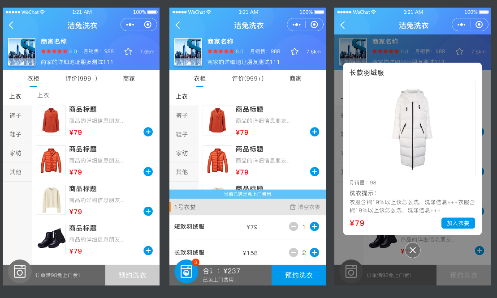
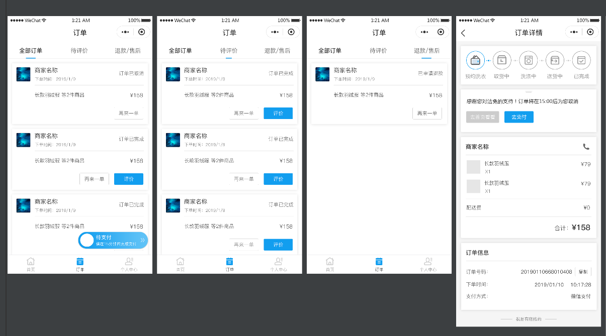
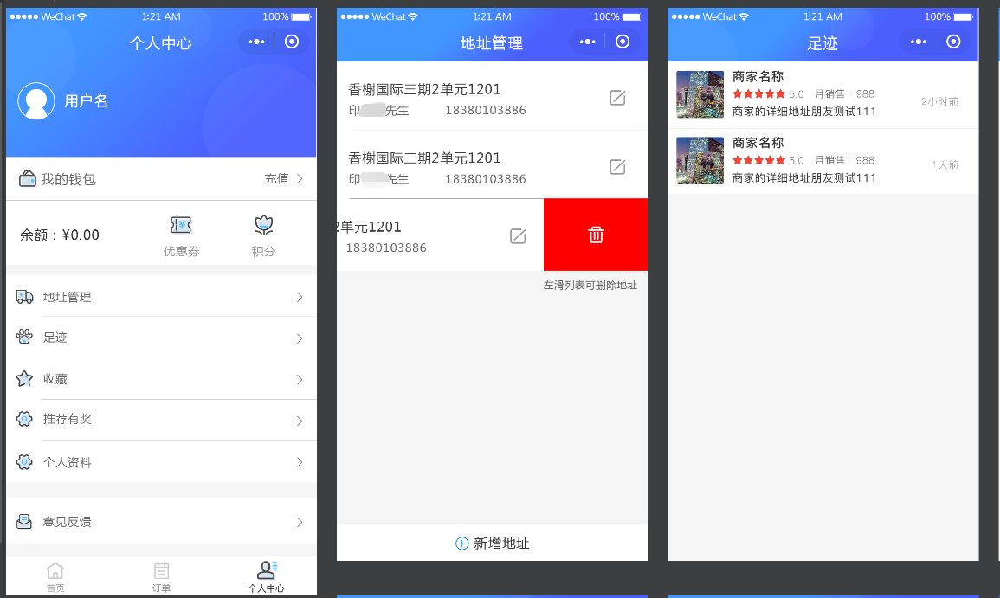

# jietu-laundry
洁兔洗衣小程序，包含小程序端，后台管理，后台程序。注释完整，欢迎大家交流学习

# 小程序功能

# 后台管理功能
## 商品管理：
* 商品管理
* 商品类型管理
* 商品规格
* 商品评论

## 订单管理：
* 订单管理

## 支付管理：
* 支付管理

## 客户管理：
* 客户管理
* 客户订单
* 客户地址
* 客户收藏
* 客户足迹
* 客户购物车
* 客户优惠券

## 系统管理：
* 用户管理
* 权限管理
* 菜单管理
* 系统参数
